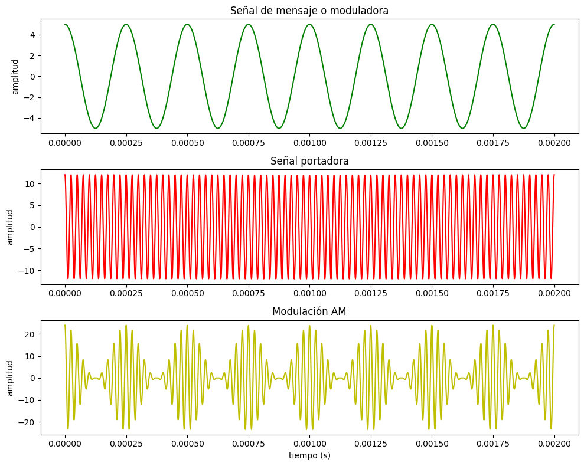
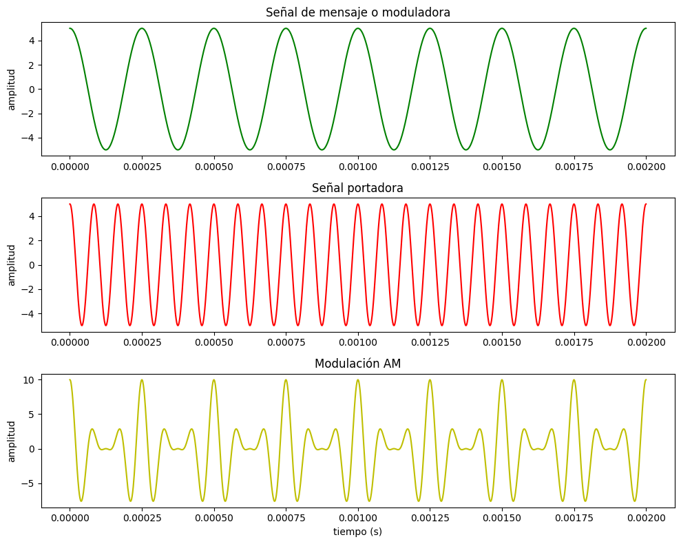
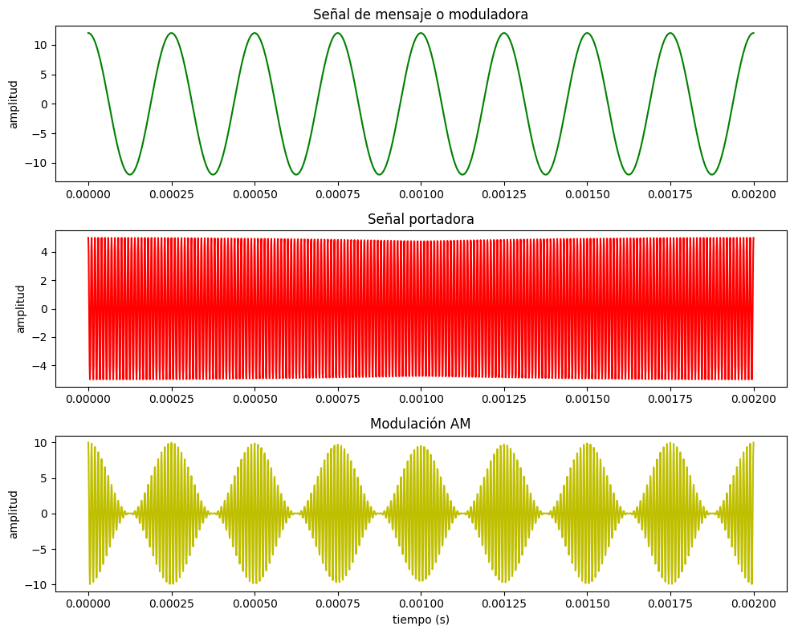

# Preguntas

3.1. ¿En qué se diferencia un medio guiado de un medio no guiado?

3.2. ¿Cuáles son las diferencias entre una señal electromagnética analógica y una digital?

3.3. ¿Cuáles son las tres características más importantes de una señal periódica?

3.4. ¿Cuántos radianes hay en 360o?

3.5. ¿Cuál es la relación entre la longitud de onda y la frecuencia en una onda seno?

3.6. ¿Cuál es la relación entre el espectro de una señal y su ancho de banda?

3.7. ¿Qué es la atenuación?

3.8. Defina la capacidad de un canal.

3.9. ¿Qué factores clave afectan a la capacidad de un canal?

4.1 ¿Por qué hay dos cables en un par trenzado de cobre?

4.2. ¿Cuáles son las limitaciones del par trenzado?

4.3. ¿Cuál es la diferencia entre el par trenzado no apantallado y el par trenzado apantallado?

4.4. Describir los principales componentes del cable de fibra óptica.

4.5. ¿Qué ventajas y desventajas tiene la transmisión de microondas?

4.6. ¿Qué es la difusión directa por satélite (DBS, Direct Broadcast Satellite)?

4.7. ¿Por qué un satélite debe usar frecuencias ascendentes y descendentes distintas?

4.8. Indique las diferencias más significativas entre la difusión de radio y las microondas.

4.9. ¿Qué dos funciones realiza una antena?

4.10. ¿Qué es una antena isotrópica?

4.11. ¿Cuál es la ventaja de una antena parabólica por reflexión?

4.12. ¿Qué factores determinan la ganancia de una antena?

4.13. ¿Cuál es la principal causa de la pérdida de señal en comunicaciones vía satélite?

4.14. ¿Qué es la refracción?

4.15. ¿Qué diferencia hay entre difracción y dispersión?

15.1. ¿Qué diferencias hay entre los requisitos clave para las redes existentes en salas de computadores de aquellos necesarios para redes de área local de computadores personales?

15.2. ¿Qué diferencias hay entre una red LAN de respaldo, una red SAN y una red LAN troncal?

15.3. ¿Qué es la topología de una red?

15.4. Enumere cuatro topologías comunes para redes LAN y describa brevemente su principio
de funcionamiento.

15.5. ¿Cuál es el propósito del comité IEEE 802?

15.6. ¿Por qué existen diferentes normativas para redes LAN?

15.7. Enumere y describa brevemente los servicios proporcionados por LLC.

15.8. Enumere y describa brevemente los modos de operación proporcionados por el protocolo
LLC.

15.9. Enumere algunas funciones básicas que se realicen en la capa MAC.

15.10. ¿Qué funciones lleva a cabo un puente?

15.11. ¿Qué es un árbol de expansión?

15.12. ¿Qué diferencias existen entre un concentrador y un conmutador de capa 2?

15.13. ¿Cuál es la diferencia entre un conmutador de almacenamiento y envío y uno rápido?

---

3.1 La Principal diferencia es por donde viajan los datos, mientras que el medio guiado utilizan componentes fisicos y tangibles para la transmision, los medios no guiados utilizan el aire para transmitir ondas electromagneticas

3.2 Una señal Analogica es una onda electromagnetica continua, que varia constantemente de valor, mientras que una señal digital se compone de pulsos que toman solo dos valores, 0 y 1.
La señal analoga es mas sensible al ruido y a los errores, mientras que la digital es mas resistente al ruido

3.3 Sus caracteristicas son:

**Periodo** : Cantidad de tiempo transcurrido entre dos repeticiones consecutivas de señal

**Amplitud** : Valor maximo de laseñal en el tiempo

**Frecuencia** : Es el numero de veces que la onda se repite en un segundo

3.4 2π = 360° = 1 Periodo

3.5 La longitud de onda y la frecuencia estan relacionadas por la velocidad de propagacion. Ya que la frequencia se representa en oscilaciones/tiempo y la longitud de onda en distancia/oscilacion. se cumple que la velocidad de propagacion en distancia/tiempo completa la ecuacion para su relacion de la forma: velocidad de propagacion = longitud * frecuencia 

3.6 la relacion entre el espectro de una señal y su ancho de banda se basa en la definicion de ancho de banda. una señal expresada en frecuencia tendra una frecuencia minima y maxima que la representan, el ancho de banda es simplemente la distancia en frecuencia de este minimo y maximo. Teniendo una señal cuyo espectro tiene un componente minimo de 60hz y maximo de 300hz el ancho de banda seria 240hz.

3.7 La atenuación es el fenómeno de la reducción en la intensidad de una señal mientras se propaga por el espacio. Es consecuencia de que una señal tiene energía limitada y al propagarse en mas espacio disminuye su intensidad. Aun para señales que se propagan en medios guiados se produce atenuación por la interacción de la señal con materia quitándole energía. Por esto cualquier receptor medirá con menor intensidad la señal mientras mas se distancie del transmisor.

3.8 La capacidad de un canal es la velocidad de transmisión máxima a la que pueden comunicarse el transmisor y receptor por un canal especifico. Esto es claramente una propiedad del canal.

3.9 los factores que la afectan son:
- velocidad de transmisión
- ancho de banda
- ruido
- tasa de errores
  
En conjunto los primeros dos factores no pueden incrementarse indefinidamente sin que los factores 3 y 4 reduzcan la tasa de transmisión de información efectiva y aumente el costo.

4.1 Hay 2 cables en un par trenzado para poder cerrar el circuito electrico, uno de los cables lleva la señal del emisor al receptor y el otro cable sirve como retorno para cerrar el circuito.

4.2 El par trenzado es el metodo mas comun y economico usado, pero tambien tiene limitaciones, como permtir distancias menores, menor ancho de banda y menor velocidad de transmisión que otros medios guiados como el cable coaxial o la fibra optica.

-Al transmitir señales analógicas exige amplificadores cada 5 km o 6 km. Para transmisión digital , el par requiere repetidores cada 2 km o 3 km.
-La atenuación crece notablemente con la frecuencia, lo que limita su uso a distancias cortas o velocidades moderadas.
-Se caracteriza por su gran susceptibilidad a las interferencias y al ruido, debido a su fácil acoplamiento con campos electromagnéticos externos. 

4.3 La diferencia ente el par trenzado apantallado y el no apantallado es basicamente la proteccion del blidaje metalico que mejora la resistencia al ruido y permite mayores velocidades a costa de un mayor costo y complejidad para instalarlo.

4.4 Un cable de fibra óptica tiene forma cilíndrica y está formado por tres secciones concéntricas:el núcleo, el revestimiento y la cubierta.

- El nucleo: Es la sección más interna, está constituido por una o varias fibras de cristal o plástico, con un diámetro entre 8 y 100m.
- EL revestimiento: que no es sino otro cristal o plástico conpropiedades ópticas distintas a las del núcleo. La separación entre el núcleo y el revestimiento actúa como un reflector, confinando así el haz de luz, ya que de otra manera escaparía del núcleo.
- La cubierta: está hecha de plástico y otros materiales dispuestos en capas para proporcionar protección contra la humedad, la abrasión, posibles aplastamientos y otros peligros.

4.5 Ventajas : mayor separacion y menor cantidad de repetidores
    Gran ancho de banda y alta velocidad de transmisión
    Menor coste y facilidad de despliegue frente a los cables

Desventajas : Exigencia de linea de vista directa y alineacion estricta 
        Atenuacion por lluvia y absorcion por oxigeno y vapor de agua
        Peligro de solapamiento y interferencias, se tiene que realizar una asignacion de bandas muy estricta
        Retardo de propagacion ~250 ms


4.6 La difusión directa via satelite (DBM) es la aplicación mas reciente de la tecnologia satelital a la televisión, en la que la señal de vídeo se transmite directamente desde el satélite a los domicilios de los usuarios, sin pasar por estaciones receptoras intermedias que redistribuyan la programación.
Esta difusion se diferencia del modelo tradicional de distribución de TV via satelite, donde una emisora local transmite la programación al satelite, y este la difunde a una serie de estaciones receptoras, las cuales luego redistribuyen la señal a los usuarios finales.

4.7 Un satelite debe utilizar frecuencias ascendentes y descendentes distintas porque en una transmisión continua y sin interferencias, el satélite no puede transmitir y recibir en el mismo rango de frecuencias al mismo tiempo.
Si el satelite recibiera la señal de las estaciones terrestres y simultáneamente, retransmitiera su propia señal en la misma banda, la señal fuerte que el propio satelite está emitiendo interferiría y se mezclaría con la señal débil que está tratando de recibir desde tierra, haciendo imposible distinguir una de la otra.
Por esto los satelites usan un canal ascendente y uno descendente, esta separación de frecuencias es lo que permite que el satelite funcione como un repetidor eficaz. Recibe en una banda, amplifica o repite la señal, y la retransmite en otra banda diferente, evitando así la interferencia entre la señal entrante y la saliente.

4.8 La diferencia mas significativa es la direccionalidad, las ondas de radio son omnidireccionales, es decir que se propagan en todas las direcciones. Mientras que las microondas viajan concentradas en un haz direccional, por lo que necesitan antenas parabólicas bien alineadas para transmitir, algo que las ondas de radio no requieren
Rango : microondas van desde 1 a 40 GHZ , ondas de radio, tomando en cuenta la banda vhf y parte de uhf, van desde los 30mhz a 1ghz
Atenuacion : para las ondas de radio interviene el ruido cosmico y la dispersion por inversion termica, mientras que la microondas son atenuadas por la lluvia por encima de los 10ghz, es atenuacion atmosferica debida al vapor de agua y al oxigeno

4.9 La antena realiza dos funciones :
    Transmisión: la energia electrica proveniente del transmisor se convierte a energia electromagnética en la antena, radiandose al entorno cercano.
    Recepción: la energia electromagnetica caoturada por la antena se convierte a energia electrica y se pasa al receptor.

4.10 Es un punto en el espacio que radia potencia de igual forma en todas las direcciones. Es un modelo teorico ideal ya que no existe ninguna antena perfecta, sin embargo sirve como un estandar de referencia para medir ganancia y direccionalidad

4.11 La principal ventaja es su direccionalidad y ganancia
    En trasmision, la energia emitida rebota en el plato y sale proyectada en rayos paralelos y evita que la energi se disperse en todas direcciones permitiendo que viaje muchos kilometros.
    En recepcion, el plato capta todas las ondas y las concentra en un unico punto, amplificando esa señal recibida
    Ese mismo enfoque y recepcion unico, ignora el ruido y señales de interferencia.

4.12 Los factores que determinan la ganancia de la antena son, el area efectiva y la longitud de onda o la frecuencia de la protadora. 
Segun la sigueinte ecuacion:

$$G=\frac{4\pi A_e}{\lambda^2}=\frac{4\pi f^2A_e}{c^2}$$

Tambien deberiamos tener en cuenta la potencia de salida de la antena en una direccion, comparada a con la potencia transmitida en cualquier direccion.

4.13 La principal causa de perdida de la señal en comunicaciones satélites es la distancia entre la antena emisora y la receptora.
También podemos mencionar al scattering como una de las cusas de la perdida de comunicación, el cual es fenómeno que consiste en el cambio de dirección o frecuencia que sufre una onda al encontrarse con partículas de materia.

4.14 La refracción es un fenómeno producido cuando una onda electromagnética se desvía debido a un cambio en el medio que atraviesa. Esto se debe a que la velocidad de la onda electromagnética varia dependiendo de la densidad del medio que atraviesas ocasionando que esta se desvié.

4.15 La difracción es el fenómeno que nos habla del comportamiento de las ondas electromagnéticas en presencia de obstáculos de gran tamaño un ejemplo de esto podría ser un edificio. Por otro lado la dispersión nos habla mas sobre el comportamiento de la onda frente a objetos pequeños como gotas de lluvia o niebla.


15.1 La principal diferencia entre las LAN de computadoras personales y redes en salas de computadores es la velocidad y el precio. El requisito principal de las redes de respaldo es la transferencia elevada de datos entre un número limitado de dispositivos en un área reducida, junto con la alta fiabilidad. en cambio en las redes LAN personales el requisito principal es el bajo coste ("El coste de la conexión a la red debe ser significativamente menor que el del propio dispositivo conectado"). A menor coste tambien signifca que la velocidad de la red puede quedarse liimitada, por eso en redes con dispositivos muy caros conectados es mas que recomendable la inversion en redes mas veloces y de mayor costo.

15.2 La principal diferencia entre una red LAN de respaldo, una SAN y una red LAN troncal es que resuelven distintos problemas.

La red de respaldo interconecta sistemas grandes y caros: mainframes, supercomputadores y dispositivos de almacenamiento masivo, dentro de una sala de computadoras. Su objetivo es la transferencia de datos a muy alta velocidad entre un número reducido de dispositivos con alta fiabilidad.

La red SAN es una evolucion de la red de respaldo,esta es una red de respaldo especializada y reestructurada específicamente para el almacenamiento, que desliga las tareas de almacenamiento de servidores específicos.

por ultimo la red LAN troncal resuelve un problema distinto, no de rendimiento entre dispositivos caros, sino de organizacion de conexiones entre multiples LAN, esta surge porque desplegar una única LAN para todo un edificio tiene tres problemas serios:

Fiabilidad: una caída de esa LAN única afecta a todos los usuarios.
Capacidad: se satura a medida que crece el número de dispositivos conectados.
Coste: una sola tecnología de LAN no es óptima para todos los requisitos de interconexión, y forzar a microcomputadores baratos a usar una red de gran capacidad no tiene sentido economico.

La solucion a esto es usar LAN de menor coste y capacidad por edificio o departamento, e interconectarlas todas mediante una LAN de mayor capacidad, que es justamente la LAN troncal.

15.3 "En el contexto de una red de comunicaciones, el término topología se refiere a la forma según la cual se interconectan entre sí los puntos finales, o estaciones, conectados a la red".

la topologia describe el patron geometrico y logico de interconexion entre las estaciones de la red, se describen 4 topologias LAN principales: Bus, arbol, anillo y estrella.


15.4 Topologia en Bus y en arbol: Ambas se caracterizan por la conexión multipunto. La topologia bus todas las estaciones se encuentran conectadas directamente a traves de taps, su funcionamiento es full-duplex. En cambio la topologia en árbol, es una generalizacion de la topologia en bus, empieza desde un punto conocido conocido como raiz o cabecera, donde uno o mas cables comienzan desde ahi y cada uno puede presentar ramificaciones.
El principal problema de este tipo de conexion es el metodo para elegir a quien pertenece la informacion transmitida, ya que la misma alcanza todas las estaciones, y de que manera regular la comunicación, ya que dos o mas pueden transmitir al mismo tiempo ocasionando distorsion.

Topología en anillo: Consta de un conjunto de repetidores conectados formando un bucle cerrado. El enlace es unidireccional, los datos se transmiten en un solo sentido a través de repetidores donde los datos se transmiten en tramas, donde al llegar al destino, copia la trama y sigue su rumbo hasta llegar de nuevo a su origen.

Topología en estrella: Cada estación esta conectada a un nodo central a través de dos enlaces, uno para transmisíon y otro para recepción.
Su funcionamiento puede ser muy parecido a la topologia en bus, donde una estacion retransmite a traves de todos los enlaces de salida del nodo central.
Otro modo de funcionamiendo es usar el nodo como un dispositivo de conmutación (switch), donde la trama entrante se almacena en el nodo temporalmente y luego se transmite hacia la estacion de destino.


15.5 El proposito del comite es desarrollar estandares de redes LAN y WAN enfocados en aspectos de la capa fisica y enlace de datos para mantener redes interoperables. Son responsables por las principales tecnologias de conexion en redes como Ethernet, WiFi, vLAN, STP, etc.

15.6 Las diferentes normativas para las redes lan existen para acomodar requisitos diferentes en implementacion. Las normativas tratan de mantener interoperabilidad para un estandar pero mantienen estandares diferentes de medios fisicos, velocidades o tecnologia de transmision. Esta versatilidad permite tener dispositivos moviles(los cuales no pueden cablearse comodamente) y dispositivos fijos en una misma red utilizando dispositivos que utilizen dos o mas tecnologias para interoperar en estas normativas.

15.7 La subcapa LLC proporciona 3 tipos de servicios:
- servicio no orientado a conexion sin confirmacion: Este no garantiza la recepcion de datos, dejando esa tarea a capas superiores. Util cuando manterner una conexion es demasiado caro computacionalmente o cuando una capa superior ya implementa deteccion de errores/perdida de paquetes
- servicio en modo conexion: los dos "usuarios" forman una conexion por la cual intercambian datos, en esta existe el control de flujo y deteccion de errores. Util cuando la implementacion de software de las capas superiores es muy simple, LLC reduce la necesidad de implementar los mecanismos que ya provee
- servicio no orientado a conexion con confirmacion: no existe conexion previa pero el receptor confirma recibir los datagramas. Util cuando hay demasiados dispositivos no centrales para mantener conexiones activas pero se requiere confirmacion de recepcion de datagramas

15.8 Los tres tipos de operacion son:
- operacion de tipo 1: presta el servicio no orientado a conexion sin confirmacion utilizando la Pdu de informacion no numerada
- operacion de tipo 2: presta el servicio en modo conexion utilizando el modo de operacion balanceado asincrono de HDLC(unicamente)
- operacion de tipo 3: presta el servicio no orientado a conexion confirmado con dos PDU, una de orden y una de respuesta para confirmar que la anterior fue recibida

15.9 En la capa mac se realizan las siguientes funciones:
- control de accesso al medio
- deteccion de errores mediante CRC
- control de tamaño y formato de tramas
- direccionamiento fisico(mediante direcciones de origen y destino)

15.10 Un puente se encarga de connectar redes LAN similares. Estos realizan dos funciones en ambas direcciones entre dos redes lan:
- Lectura de las tramas transmitidas en red 1 y aceptar tramas dirigidas a la red 2
- retransmitir hacia la red 2 todas las tramas

15.11 Es un algoritmo para encaminamiento entre redes, util para cuando existen caminos redundantes. Se basa en 3 aspectos:
- retransmision de tramas
- aprendizaje de direcciones
- evitar bucles
Es importante el ultimo en caso de que se emita un broadcast y no cree un bucle infinito. STP bloquea uno de los enlaces para cortar bucles y lo rehabilita en caso de que sea necesario

15.12 La principal diferencia entre un concentrador(hub) y un conmutador de capa 2(switch) es que el switch solo emite los paquetes entrantes a el puerto correspondiente al destinatario.
un hub repite las tramas a todos los puertos sin entender quien debe recibirlos. Los dispositivos en un mismo hub no pueden transmitir al  mismo tiempo, ya que los paquetes colisionarian
Ademas el hub distribuye el ancho de banda de la conexion entre los dispositivos conectados, mientras que un switch mantiene la velocidad maxima del link para cada uno.

15.13 La principal diferencia es que el conmutador rapido inicia la transmision de la trama al receptor cuando aun esta recibiendo la trama del remitente, esto es posible ya que cuando recibio el inicio de la trama con la direccion mac de destino sabe a donde debe transmitir. En comparacion un conmutador de almacenamiento y envio acepta la trama y almacena su totalidad antes de retransmitirla a el puerto correspondiente.
El conmutador rapido tiene la desventaja que no puede detectar tramas erroneas antes de retransmitirlas, ya que necesita conocer la trama entera para verificar su crc.


---
# Ejercicios

3.1 

A. Trasmite solo uno a la vez, porque comparten el mismo medio físico de transmisión.
Si transmiten al mismo tiempo provocaría una interferencia destructiva, por eso el medio tiene que compartirse temporalmente, solo a la estación que tenga el turno de emisión

>B.

3.2 con una frecuencia fundamental de 1000Hz 1/1000hz = 1ms

3.3
>A. sen(2π F t - π)*2 experiencian interferencia constructiva
>B. difieren en 180° por lo tanto = 0 experimentan interferencia destructiva

3.4  Pensando en frecuencias relativas podemos ver que un salto de 1 octava duplica la frecuencia. Notas mas altas tienen frecuencias mayores mientras que sus longitudes de onda se vuelven menores. Tambien podemos destacar que la longitud de onda del MI es de 1m aproximadamente. Un MI una octava mayor tendrá una longitud de onda de 0.5m

3.5 ya que tiene el doble de amplitud y frecuencia. Se puede representar como 2*sen(2π * 2t + π). Tiene un desfase de 180° ya que en los alrededores de 0 difieren en signo

3.6 resolvemos con los siguientes pasos:
- cos(100t)+ 0,1 cos(5t)*cos(100t)
- por la expresion de cos(a)*cos(b) -> 0,1 cos(5t) * cos(100t) = 0,05 cos(95t) * 0.05 cos(105t)
- reemplazando obtenemos cos(100t) + 0,05 cos(95t) + 0,05 cos(105t)

3.7. 
- expandiendo obtenemos (10cos(t))*(10cos(t))
- 100 * cos²t, ignoramos la amplitud de 100 ya que no affecta la frecuencia 
- cos(t) tiene un periodo de 2π. cos² se vuelve positivo para la onda positiva y negativa de cos, por lo tanto su frecuencia es el doble y su periodo la mitad, tiene un periodo de π

3.8 La Suma de dos funciones periodicas da como resultado una Funcion con frecuencia fundamental, solo si la frecuencia de la segunda componente es múltiplo entero de la frecuencia de la segunda componente.
Si no es asi, no existe relacion tal que la componente resultante no es ninguna frecuencia fundamental común y se convierte en una señal no periódica

3.9.
La señal resultante se convertiría en una serie de picos agudos o impulsos periódicos que marcan los instantes exactos de las transiciones de voltaje, perdiendo sus tramos planos al carecer de la energía que aportan las bajas frecuencias, esto podria
interpretarse como una mini curva de descarga de un pequeño capacitor con una carga instantánea.


3.10
Esto tiene varias implicancias, la mayor de ellas siendo que al requerir un ancho de banda infinito cualquier sistema real limitaría estas frecuencias, lo que introduce distorsiones en la señal lo que dificulta su interpretación y agrega errores.   

3.11 Se lograba cambiar de mayusculas y minusculas mediante un caracter llamado SHIFT que cambiaba el modo de funcionamiento, era remplazado las letras minúsculas por sus respectivas letras mayúsculas y los digitos por otros caracteres especiales.
El codigo TeleTypesetter (TTS) utilizaba como base el codigo de murray, sumando un bit mas, duplicando las combinaciones binarias directas

Fuente : https://www.smecc.org/teletypes_in_typesetting.htm

3.12 Utilizando la misma relacion 4:3 , calculamos las resoluciones por separado
Resolucion Horizontal :
Calculamos los ciclos por linea
Ciclos = Fmax * Tactivo = 5Mhz * 52,5us = 262,5

Entonces la resolucion horizontal alcanzada por cada ciclo completo : 
2 * 262,5 = 525 lineas

Resolucion Vertical: 
Usando la misma resolucion horizontal 450 y un ancho de banda de 5Mhz, la duracion de una linea es 

Tactivo = (450/2) / 5Mhz = 45us

usando los aproximandamente 11 reservados para el retroceso horizontal

45us + 11,2 = 56,2 us

Entonces, el escaneo dura 1/30 ≈ 33.33, con el tiempo de linea se puede calcular el total de lineas verticales

33.333us / 56,2 ≈ 593 lineas

3.13  
A) Para determinar la cantidad de bits debemos hacer la siguiente cuenta: bits*pixeles*fps
los bits en este caso serian 5, ya que 2^5=32 colores que necesitamos
osea resolviendo 480*500*5*30 = 36000000 bps == 36 megabits

B)  Para saber el ancho maximo del canal usamos la formula de shanon, con una snr de 35db, resolviendo obtenemos que
c = 4,5 × 10^6 log2​(1 + snr (3162,3))
c = 52,3 megabits

C)  Se pueden reemplazar los 32 niveles de intensidad por 3 colores con 10 niveles de intensidad cada uno, obteniendo 3x10 = 30 posibles estados por píxel.
Como 30 estados todavía pueden codificarse con 5 bits, la velocidad permanece igual

3.14 
N = 10log k + 10log T + 10log b 

K : constante de boltzmann T : Temperarura absoluta en grados kelvin b : Ancho de banda
Reemplazando :
N = -228,4dBW + 10log(10000) + 10log(1000000) = -228,4 + 40 + 70 = -118,6 dBW

3.15  Usando la formula de shanon, buscamos la SNR y obtenemos
c = 475 bps

3.16
Usando la formula de Nyquist (Pag 84)

C = 2B log2 M

Para 4 bits (M = 2⁴ = 16)
9600 = 2 * B * log2(16)
9600 = 2 * B * 4
9600 = 8 * B
B = 9600 / 8 = 1200 Hz (1.2 kHz)

Para 8 bits (M = 2^8 = 256)
9600 = 2 * B * log2(256)
9600 = 2 * B * 8
9600 = 16 * B
B = 9600 / 16 = 600 Hz (0.6 kHz)

3.17
N = 10log k + 10log T + 10log b

Con la temperatura, en kelvin : 50 + 273 = 323 K
Y los 1000w de la señal transmitida, que no afecta al calculo, quedaria como:
N = -228,6 dBW + 10log(323) + 10log(10000) = -228,6 + 25,09 + 40 = -163,51 dBW

3.18 Relacion de Shannon y Nysquit

La aproximacion de Nysquit para un canal sin ruido establece que el límite máximo en la velocidad de transmisión basándose exclusivamente en el ancho de banda disponible B y el numero de senales discretas o niveles de tension es M. Su formulación es C = 2B*log_2 M

Por otro lado la aproximacion de Shannon para un canal con ruido nos dice el límite teórico máximo de transmisión de un canal real considerando la distorsión introducida por el ruido térmico, utilizando la relación señal-ruido (NR). Su formulación es C = B*log_2 (1 + SNR)

Con esto podemos decir que la relacion entre estas aproximaciones es que la fórmula de Shannon se utiliza primero para calcular el límite superior teórico absoluto de la capacidad de un canal dadas sus condiciones de ruido.
Una vez conocido este límite máximo, se utiliza la fórmula de Nyquist para determinar cuántos niveles de señalización diferentes M serían necesarios para alcanzar exactamente esa capacidad teórico, como se vio en el ejemplo 3.3

3.19 Sea un canal con una capacidad (C) de 20 Mbps. El ancho de banda (B) de dicho canal es 3 MHz. ¿Cuál es la relación señal-ruido admisible para conseguir la mencionada capacidad? 
Utilizando la formula de Sharron:

20Mbps = 3 MHz*log_2 (1 + SNR)

20/3 = log_2 (1 + SNR)

2^(20/3) = 1 + SNR

2^(20/3) - 1 = SNR

Resolviendo esto obtenemos una relacion senal ruido (SNR) de 100.59, que explesada en db seria 10*log_10(100.59) = 20.02db

3.20
A) De la señal con frecuencia fundamental de 1Khz y armonicos en 3Khz, 5Khz, 7Khz 9Khz... El filtro deja pasar los armónicos con k impar menores a 8, es decir k = 1, 3, 5, 7 (k = 9 y mayores quedan bloqueados por exceder la frecuencia de corte).
Cada armónico tiene amplitud Ak = (4/π)·(1/k), y su potencia es Pk = Ak²/2 = 8/(π²·k²).
Potencia total de salida:

Po = (8/π²) · (1/1² + 1/3² + 1/5² + 1/7²)
Po ≈ 0,95 W

b) para el SNR de salida, con ruido termico es igual a N0 * ancho de banda(en este caso 8000)
Pnoise= 0,0000001 * 8000 = 0.0008W = 0.8mW
SNR: Po/Pnoise = 0.95w/0.0008W = 1187.5
o en escala logaritmica 30.75dB


# Punto D

caso base del codigo:
```
import numpy as np
import matplotlib.pyplot as plt

A_m = 5
F_m = 4000
A_p = 5
f_p = 40000
ka = 1

fs = 1_000_000
t = np.linspace(0, 0.002, int(fs*0.002))

moduladora = A_m*np.cos(2*np.pi*F_m*t)
portadora = A_p*np.cos(2*np.pi*f_p*t)
modulacion_AM = A_p*(1+ka*np.cos(2*np.pi*F_m*t))*np.cos(2*np.pi*f_p*t)

plt.figure(figsize=(10,8))

plt.subplot(3,1,1)
plt.title("Señal de mensaje o moduladora")
plt.plot(t, moduladora, "g")
plt.ylabel("amplitud")

plt.subplot(3,1,2)
plt.title("Señal portadora")
plt.plot(t, portadora, "r")
plt.ylabel("amplitud")

plt.subplot(3,1,3)
plt.title("Modulación AM")
plt.plot(t, modulacion_AM, "y")
plt.ylabel("amplitud")
plt.xlabel("tiempo (s)")

plt.tight_layout()
plt.show()
```
*Resultado:*



*prueba con frecuencia portadora menor y amplitud portadora mayor:*



*prueba con frecuencia portadora mayor y amplitud moduladora mayor:*



4.1 

Calculamos cuantos disquetes transporta el avion. El avion transporta 10.000 kg de disquetes y cada disquete pesa 0,03 kg entonces si hacemos la division $10000/0.03 = 333.333,33$ disquetes.

sabemos que cada disquete transportan 1.4 Mbytes de datos, entonces la cantidad total de datos que transporta el avion es $1.4 Mbytes \times 333.333,33 = 466.666,67 MB$.

nos piden la velocidad en bits, asi que calculamos los bits multiplicando por 1 000 000 y luego x 8 = 3,733 ×10^12 bits.

ahora calculamos el tiempo del viaje, 5.0000 km a 1000km/h es igual a 5 horas o 18.000 segundos. entonces la velocidad de transmision seran los datos/tiempo:

$3,733 ×10^12 bits / 18.000 seg = 2,07×10^8 bits/seg$


4.2

La formula de dB para perdida/ganancia es:

$$
dB= 10 log_{10} (P_{salida} / P_{entrada})
$$

si tenemos una perdida de 20 dB y la potencia de la señal de entrada es de 0.5 W

$-20 = 10 log_{10} (P_{salida} / 0.5)$

$log_{10} (P_{salida} / 0.5 )= -2$ 

$P_{salida} = 0.005 W o 5000 uW$

ahora con estos datos calculamos la relacion señal ruido en la salida:

$S/N = 5000 uW / 4,5 uW = 1.111,1$

y por ultimo convertimos a dB.

$10 log_{10} (1.111,1) = 30,46 dB$


4.3

Dada la fuente de 100 W y la potencia a recibir de 1 W, la perdida maxima seria:

$dB = 10 log_{10} (100/1) = 20 dB$

ahora usamos las tablas empiricas de cada uno de los medios para obtener la atenuacion de cada medio:

a) par trenzado a 300khz = $13 db/ km$
b) par trenzado a 1 Mhz = $20 db/km$
c) cable coaxial a 1 Mhz = $2,5 db/km$ 
d) cable coaxial a 25 Mhz = $10 db/km$
e) fibra optica a frecuencia ideal = $0.2 db/km$

con estos valores puedo calcular la maxima longitud alcanzable (dB/atenuacion):

a) $1,5 Km$
b) $1 Km$
c) $8 Km$
d) $2 Km$
e) $100 Km$

4.4

El conectar la malla exterior a la tierra, supone varias ventajas:

1. Absorbe ondas electromagneticas ambientales, esas corriente parasitas son derivadas hacia tierra, impidiendo que induzcan algun efecto sobre el conductor central.
2. La misma señal que viaja por el conductor central, no se escapa de ese mismo entorno, evitando interferencias en otros cable o dispositivos cercanos
3. La malla funciona como seguridad electrica tambien, si el cable sufre alguna descarga electrostatica, contacto con otro cable externo o algun fenomeno natural, esa energia es desviada de forma segura protegiendo equipos electronicos y personas.
4. Funciona como referencia estable de 0V


4.5 
Doble de freq de transmisión

$L_{dB}=20log(f)+20log(d)−147,56$

$L_{dB*}= 20log(2f) + 20log(d)−147,56 = 20[log(2) + log(f)] + 20log(d)−147,56  = 20log(2) + 20log(f)+20log(d)−147,56$

$L_{dB*} – L_{dB} = 20log(2) = 6,02 dB$

Doble de distancia entre antenas

$L_{dB}=20log(f)+20log(d)−147,56$

$L_{dB*}= 20log(f) + 20log(2d)−147,56 = 20log(f) + 20[log(2) + log(d)]  - 147,56  = 20log(f) + 20log(2) + 20log(d)−147,56$

$L_{dB*} – L_{dB} = 20log(2) = 6,02 dB$

Concluimos que en ambos casos, la pérdida L aumenta 6 dB. Como L representa la relación entre la potencia transmitida y la recibida ($L = 10log(P_t/P_r)$), si L sube 6 dB y Pt no cambia, entonces Pr tiene que bajar.

4.6

La formula de longitud de onda es:

$$
λ = \frac{c}{f}
$$
    
donde c es la velocidad de la luz (c ≈ 3 × 10⁸ m/s = 300.000
km/s) y f es la frecuencia.

Teniendo una frecuencia de 30 Hz:

$$
λ = \frac{3 \times 10^8 m/s}{30Hz} = 10.
000.000 m = 10.000 km
$$

La longitud deseable de las antenas es del orden de la mitad
de la longitud de onda:

$$
L_a = \frac{λ}{2} = \frac{10.000}{2} = 5.000 km
$$

La longitud teórica de la antena para transmitir a 30 Hz es
de 5.000 kilómetros.

4.7 

a) La longitud de una antena para enviar una señal de 300 Hz se puede calcular teniendo en cuenta la relacion entre la longitud de onda λ, la frecuencia f y la velocidad de la luz. Con esto podemos calcular la longitud de onda. 
$λ = c/f = 3\times10^8/300 = 1.000.000 metros$
Entonces ahora teniendo una longuitud de onda y teniendo en cuanta que nos dicen en la consina que la longitud de la antena sera equivalente a la mitad de onda. Podemos calcularla como.
$Longitud = λ/2 = 1.000.000/2 = 500.000 metros$.
Por lo cual nuestra antena para poder transmitir señales de voz directamente seria de 500 km de largo

b) Si tenemos una antena de 1 metro de longitud y queremos saber la frecuencia necesaria de la señal portadora entonces podemos usar la relacion anterior. Primero debemos calcular la longitud de onda entonces $Longitud = λ/2.
λ = 1\times2 = 2 metros$ de longitud de onda
Ahora con la longitud de onda calculamos la frecuencia de la señal. 
$λ = c/f  => f = c/λ = 3*10^8/2 = 150.000.000$,
Entonces la señal portadora tendrá una frecuencia de 150Mhz

4.8   

Recibiría una señal de 60 GHz. 


4.9

Es lo mismo duplicar frecuencia o duplicar área de antena, el aumento será de 6dB


4.10


4.11

a) 


Entonces momo M es tangente a la curva en P, su pendiente es esa derivada. Y como L es horizontal, el ángulo α entre L y M es el ángulo que forma M con el eje x. Por trigonometría, la pendiente de una recta es igual a la tangente del ángulo que forma con el eje x:

tan⁡(α)= pendiente de M = p/y_1 

b)


Por lo tanto concluimos que el ángulo de incidencia es igual al ángulo de reflexión que también es igual a α (el ángulo con la horizontal)

4.12

Reescribiendo la ecuacion

$$
L_{dB}= 20 log_{10}(f) + 20 log_{10}(d) - 147,56 db
$$

que es la ecuacion, ya reescrita, de perdida en el espacio libre.

Necesitamos adaptarla para unidades mas grandes

$f = f_{Mhz} \times 10⁶$ Frecuencia en Megas

$d = d_{km} \times 10³$ Distancia en kilometros

Reemplazando

$$
L_{dB}= 20 log_{10}(f_{Mhz} \times 10⁶) + 20 log_{10}(d_{km} \times 10³) - 147,56 db
$$

Aplicando reglas logaritmicas

$log(A\times B) = log(A) + log(B)$

Queda:

$$
L_{dB}= 20 log_{10}(f_{Mhz}) + 20 log_{10}(10⁶) + 20 log_{10}(d_{km})+ 20 log_{10}(10³) - 147,56 db
$$

Resolviendo 

$20 log_{10}(10⁶) = 20 \times 6 = 120$

$20 log_{10}(10³) = 20 \times 3 = 60$

$120 + 60 = 180$
$180 - 147,65 = +32,44$

$$
L_{dB} = 32,44 + 20 log_{10}(f_{MHz}) + 20 log_{10}(d_{Km})
$$

4.13


4.14
Un transmisor de microondas tiene una salida de 0,1 W a 2 GHz. Suponga que este transmisor se utiliza en un sistema de comunicación de microondas en el que las antenas transmisora y receptora son parábolas, cada una con un diámetro igual a 1,2 m.
a) ¿Cuál es la ganancia de cada antena en decibelios?
b) Teniendo en cuenta la ganancia de la antena para la señal transmitida, ¿cuál es la potencia efectiva radiada?
c) Si la antena receptora se sitúa a 24 km de la antena transmisora en el espacio libre, determine la potencia de la señal a la salida de la antena receptora en dBm

a) Para resolver este ejercicio primero debemos calcular la longitud de onda de la señal de 2 GHz para esto usamos la relación λ = c/f. Quedando así, λ = 3*10^8/2*10^9 = 0.15 metros.
También necesitamos saber el área de las antenas, para eso usamos A = pi * r^2 y sabiendo el diámetro podemos calcular el radio, r = diámetro/2 = 0,6 m de esta forma nos queda, A = pi * 0.6^2 = 1.131
Ahora si podemos calcular la ganancia con la formula de una antena parabolica. 
G = 7A/λ^2 = 7 * 1.131 / 0.15^2 = 351.86
Ahora que sabemos que la ganancia es de 351.86 la debemos pasar a decibelios. Para eso:

$$G_{dB} = 10 \log_{10}(351.86) \approx 25.46 \text{ dB}$$

b) Para saber la potencia efectiva 


4.16

La linea de vision se puede expresar como (pag121):

$$
d = 3,57\sqrt{Kh}
$$

Teniendo en cuenta tambien la refraccion que sufren las ondas $K= 4/3$

Tomando $d = 80Km$

$$
80 = 3,57\sqrt{4/3 . h}
$$
La altura de la antena seria:
$$
h ≈ 377m
$$
Pero sin tomar en cuenta la refraccion(K=1), la altura de la antena quedaria:

$$
h ≈ 502m
$$
